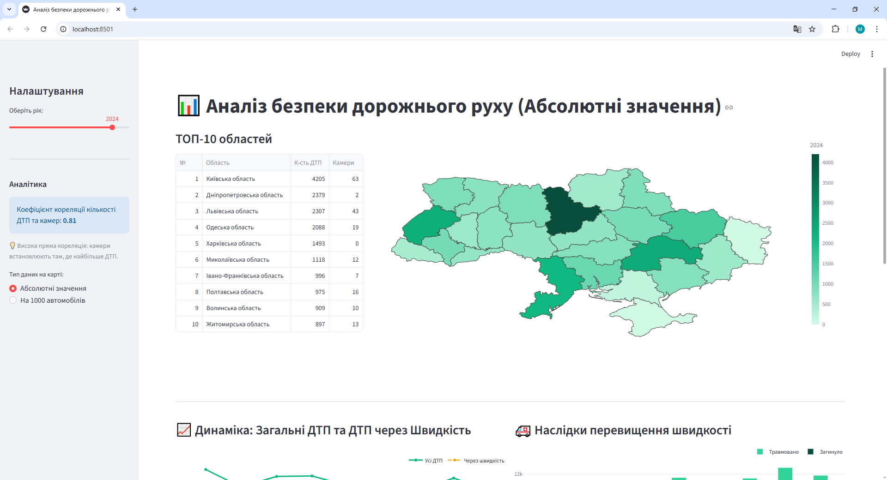

# 📊 Traffic actions
(Проект створений з навчальною метою. Галузь - Data Analysis. Перший проект)

Інтерактивний веб-додаток для аналізу статистики дорожньо-транспортних пригод (ДТП) в Україні. Проєкт візуалізує дані про аварійність, камери автофіксації та кількість транспортних засобів у розрізі регіонів за період з 2017 по 2025 рік.


*(Рекомендується додати скріншот інтерфейсу у папку проекту)*

## 🚀 Основний функціонал

* **Інтерактивна мапа України:** Теплова карта (Choropleth), що відображає статистику по областях з використанням градієнтної шкали.
* **Два режими аналізу:**
    * *Абсолютні значення:* Загальна кількість ДТП.
    * *Відносні показники:* Кількість ДТП на 1000 зареєстрованих авто (дозволяє об'єктивно оцінити рівень небезпеки).
* **Аналітичні інсайти:** Автоматичний розрахунок **коефіцієнта кореляції Пірсона** між кількістю камер автофіксації та кількістю аварій у обраному році.
* **Динаміка змін:** Графіки трендів аварійності, наслідків перевищення швидкості (травмовані/загиблі) та зростання автопарку.
* **Розумна обробка даних:**
    * Автоматичне очищення та приведення типів даних.
    * Агрегація даних Києва та Київської області для коректного відображення на мапі.
    * Обробка пропусків в історичних даних.

## 🛠 Технологічний стек

* **Python 3.10+**
* **Streamlit:** Фреймворк для створення веб-інтерфейсу.
* **Pandas:** Обробка, очищення та агрегація даних, статистичні розрахунки.
* **Plotly (Express & Graph Objects):** Побудова інтерактивних графіків та мап.
* **GeoJSON:** Візуалізація адміністративних кордонів областей України.

## 📂 Структура проєкту

```text
├── Datasets/                      # CSV файли з вихідними даними
│   ├── traffic_accidents...csv    # Статистика ДТП
│   ├── car_ownership...csv        # Автопарк по роках
│   ├── сameras_by_region.csv      # Розташування камер
│   └── ...
├── Geojson_map/
│   └── UA_FULL_Ukraine.geojson    # Географічні дані для мапи
├── main.py                        # Головний файл застосунку
├── requirements.txt               # Список залежностей
└── README.md                      # Документація
